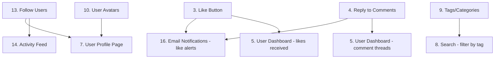

# Resonance — Feature Research & Roadmap

## Progress Checklist

### 🔴 High Priority (MVP)
- [x] 1. Footer Component
- [ ] 2. Home Page Redesign
- [ ] 3. Like Button & Like Count
- [ ] 4. Reply to Comments

### 🟡 Medium Priority (Post-MVP)
- [ ] 5. User Dashboard
- [ ] 6. Post Editing
- [ ] 7. User Profile Page
- [ ] 8. Search Functionality
- [ ] 9. Tags / Categories

### 🟢 Low Priority (Nice-to-have)
- [ ] 10. User Avatars
- [ ] 11. View Count `Quick Win`
- [ ] 12. Bookmarks
- [ ] 13. Follow Users
- [ ] 14. Activity Feed
- [x] 15. Social Sharing `Quick Win`
- [ ] 16. Email Notifications
- [ ] 17. Empty States `Quick Win`
- [ ] 18. Custom 404 Page `Quick Win`
- [ ] 19. Loading Skeletons
- [ ] 20. About & Contact Pages
- [x] 21. SEO Optimization

## Project Overview

**Stack:** Next.js 16 (App Router) + TypeScript + Convex (backend) + Better Auth + Tailwind CSS v4 + shadcn/ui

**Purpose:** A blog platform where users can create posts, comment, and engage with content.

---

## Table of Contents

- [Part 1: Currently Implemented Features](#part-1-currently-implemented-features)
  - [Authentication](#authentication)
  - [Blog Posts](#blog-posts)
  - [Comments](#comments)
  - [UI/UX](#uiux)
- [Part 2: Feature Proposals](#part-2-feature-proposals)
  - [🔴 High Priority](#-high-priority)
    - [1. Footer Component `MVP`](#1-footer-component-mvp)
    - [2. Home Page Redesign `MVP`](#2-home-page-redesign-mvp)
    - [3. Like Button & Like Count `MVP`](#3-like-button--like-count-mvp)
    - [4. Reply to Comments `MVP`](#4-reply-to-comments-mvp)
  - [🟡 Medium Priority](#-medium-priority)
    - [5. User Dashboard `MVP`](#5-user-dashboard-mvp)
    - [6. Post Editing `MVP`](#6-post-editing-mvp)
    - [7. User Profile Page](#7-user-profile-page)
    - [8. Search Functionality](#8-search-functionality)
    - [9. Tags / Categories](#9-tags--categories)
  - [🟢 Lower Priority](#-lower-priority)
    - [10. User Avatars](#10-user-avatars)
    - [11. View Count `Quick Win`](#11-view-count-quick-win)
    - [12. Bookmarks](#12-bookmarks)
    - [13. Follow Users](#13-follow-users)
    - [14. Activity Feed](#14-activity-feed)
    - [15. Social Sharing `Quick Win`](#15-social-sharing-quick-win)
    - [16. Email Notifications](#16-email-notifications)
    - [17. Empty States `Quick Win`](#17-empty-states-quick-win)
    - [18. Custom 404 Page `Quick Win`](#18-custom-404-page-quick-win)
    - [19. Loading Skeletons](#19-loading-skeletons)
    - [20. About & Contact Pages](#20-about--contact-pages)
    - [21. SEO Optimization](#21-seo-optimization)
- [Part 3: Recommended Implementation Order](#part-3-recommended-implementation-order)
- [Part 4: Technical Notes](#part-4-technical-notes)

---

## Quick Wins (< 1 hour each)

These features are small enough to knock out in a single session:

| # | Feature | Why it's quick | Effort |
|---|---------|----------------|--------|
| 18 | Custom 404 Page | Single static page, no backend changes | Low |
| 17 | Empty States | Reusable component, just text + icon | Low |
| 11 | View Count | Add one field to schema + one mutation | Low |
| 15 | Social Sharing | Pure frontend — Web Share API + OG tags | Low |

---

## MVP Scope (v1.0)

Features required for a launch-ready product:

- [x] 1. Footer Component
- [ ] 2. Home Page Redesign
- [ ] 3. Like Button & Like Count
- [ ] 4. Reply to Comments
- [ ] 6. Post Editing
- [ ] 5. User Dashboard

Everything else (Tags, Follow, Activity Feed, Bookmarks, Email Notifications, etc.) is **post-MVP**.

---

## Feature Dependencies



---

## Part 1: Currently Implemented Features

### Authentication
- Email/password sign-up and login via Better Auth
- Logout functionality
- Auth state managed via `useConvexAuth()` in Navbar
- Session stored in Convex DB (`sessions` table)

### Blog Posts
- Create post with title, body, and optional cover image
- Image upload to Convex storage (`_storage`)
- Paginated blog listing at `/blog`
- Single post view at `/blog/[postId]`
- Post author shown via `authorId`

### Comments
- Create comments on posts (requires auth)
- View comments on post page
- Comment count displayed on post cards
- Newest-first ordering

### UI/UX
- Dark/light/system theme toggle (next-themes)
- Toast notifications (Sonner)
- Responsive Navbar with navigation links
- Card-based post layouts

---

## Part 2: Feature Proposals

### 🔴 High Priority

#### 1. Footer Component `MVP`
- [x] Task

**Description:** A consistent site-wide footer appearing on all pages.

**Contents:**
- Logo or site name
- Quick links: Home, Blog, Create Post, About
- Social media icons (GitHub, Twitter, LinkedIn)
- Copyright notice with current year
- "Built with Convex" badge

**Implementation:**
- Create `components/web/Footer.tsx` as a Server Component
- Add to `app/(app)/layout.tsx` below `<Navbar />`
- Use `components/ui/` primitives (Separator, lucide icons)

**Effort:** Low | **Files:** 1 new component + layout edit

---

#### 2. Home Page Redesign `MVP`
- [ ] Task

**Description:** Replace the placeholder "INDEX PAGE" with a proper landing page.

**Sections:**
| Section | Purpose | Content |
|---------|---------|---------|
| Hero | Welcome visitors, drive action | Headline, subtext, CTA buttons (Start Blogging / View Posts) |
| Featured Posts | Showcase best content | 3–6 recent posts in card grid |
| Stats | Build credibility | "X posts, Y comments, Z users" |
| CTA | Convert visitors | "Join the community — Sign up free" |
| Recent Activity | Show liveliness | Latest comments or posts |

**Implementation:**
- Edit `app/(app)/page.tsx` to be a Server Component
- Fetch recent posts via `fetchQuery` (no auth required)
- Use existing `components/ui/card.tsx` for post cards
- Add Footer component

**Effort:** Medium | **Files:** 1 page edit + Footer addition

---

#### 3. Like Button & Like Count `MVP`
- [ ] Task

**Description:** Allow authenticated users to like posts. Display total like count.

**Data Model:**
```typescript
likes: defineTable({
  postId: v.id("posts"),  // indexed "by_post"
  userId: v.string(),     // indexed "by_user"
  createdAt: v.number(),
}).index("by_post", ["postId"])
.index("by_user", ["userId"])
```

**Functions:**
| Function | Type | Description |
|----------|------|-------------|
| `toggleLike` | mutation | Add/remove like (idempotent) |
| `getLikeCount` | query | Count likes for a post |
| `getUserLikedPosts` | query | Get all posts a user has liked |

**UI:**
- Heart icon (lucide) — hollow when not liked, filled when liked
- Count displayed next to icon
- Optimistic UI update on click
- Requires auth (show tooltip "Login to like" if not authenticated)

**Implementation:**
- Add `likes` table to `convex/schema.ts`
- Create `convex/likes.ts` with functions above
- Add like button to `app/(app)/blog/[postId]/page.tsx`
- Add like count to post cards on blog listing

**Effort:** Medium | **Files:** Schema change + 1 Convex file + UI components

---

#### 4. Reply to Comments `MVP`
- [ ] Task

**Description:** Enable threaded replies to comments (1 level deep).

**Data Model:**
```typescript
comments: defineTable({
  postId: v.id("posts"),      // indexed "by_postId"
  parentId: v.optional(v.id("comments")),  // null = top-level
  authorId: v.string(),
  authorName: v.string(),
  body: v.string(),
  createdAt: v.number(),
}).index("by_postId", ["postId"])
```

**UI Behavior:**
- Top-level comments show "Reply" button
- Clicking Reply shows inline reply form (not a new page)
- Replies indented slightly under parent
- Replies cannot have further nested replies (1 level only)
- "X replies" shown under parent comment if count > 0

**Functions:**
| Function | Type | Description |
|----------|------|-------------|
| `getCommentsByPostId` | query | Fetch all comments (both levels), ordered by `createdAt` |

**Implementation:**
- Update `convex/schema.ts` — add `parentId` optional field to `comments`
- Update `convex/comments.ts` — no new functions needed, just use `parentId`
- Update `components/web/CommentSection.tsx` — add Reply button and inline form
- Update `components/web/CommentCard.tsx` — handle replies display

**Effort:** Medium | **Files:** Schema change + 2 component updates

---

### 🟡 Medium Priority

#### 5. User Dashboard `MVP`
- [ ] Task

**Description:** A personalized page where users see their content and stats.

**Route:** `/dashboard` (add to `app/(app)/dashboard/page.tsx`)

**Sections:**
| Section | Content |
|---------|---------|
| Profile Summary | Avatar, name, member since, total posts/comments/likes received |
| My Posts | List of user's posts with edit/delete options |
| Recent Comments | User's last 10 comments across all posts |
| Liked Posts | Posts the user has liked |

**Implementation:**
- Add `createdAt` to `users` table via migration
- Create `convex/dashboard.ts` with queries for user stats
- Create `app/(app)/dashboard/page.tsx` as Client Component
- Add Dashboard link to Navbar

**Effort:** Medium | **Files:** 1 Convex file + 1 page + possible migration

---

#### 6. Post Editing `MVP`
- [ ] Task

**Description:** Allow post authors to edit their own posts.

**UI Flow:**
1. On `/blog/[postId]`, show "Edit" button only if `session.identityId === post.authorId`
2. `/blog/[postId]/edit` page — pre-filled form with existing title, body, image
3. Save updates via mutation `updatePost`
4. Redirect to updated post on success

**Implementation:**
- Add `updatePost` mutation in `convex/posts.ts`
- Create `app/(app)/blog/[postId]/edit/page.tsx`
- Add edit button to post view page
- Add `updatedAt` field to posts table (optional)

**Effort:** Medium | **Files:** 1 mutation + 1 new page

---

#### 7. User Profile Page
- [ ] Task

**Description:** Public profile page at `/profile/[userId]`.

**Contents:**
- Avatar, display name, bio (from user metadata), join date
- Grid of their posts
- "Follow" button (if auth and not self)

**Implementation:**
- Create `convex/users.ts` with `getUserProfile` query
- Create `app/(app)/profile/[userId]/page.tsx`
- Add `follows` table (see Feature #13)

**Effort:** Medium | **Files:** 1 Convex file + 1 page

---

#### 8. Search Functionality
- [ ] Task

**Description:** Search posts by title and body content.

**Approaches:**

| Approach | Pros | Cons |
|----------|------|------|
| Client-side (filter loaded posts) | Simple, no backend change | Only works with small datasets |
| Convex query with filter | Real-time, scalable | Limited text search capability |
| Algolia/Typesense | Full-text search | External service, setup complexity |

**Recommendation:** Start with Convex query filtering for MVP.

**Implementation:**
- Add `searchPosts(query: string)` query to `convex/posts.ts`
- Create `app/(app)/search/page.tsx` with search input
- Add search to Navbar (input field or icon that expands)

**Effort:** Medium | **Files:** 1 query + 1 page

---

#### 9. Tags / Categories
- [ ] Task

**Description:** Organize posts with labels.

**Data Model:**
```typescript
tags: defineTable({
  name: v.string(),  // unique, e.g., "javascript"
  slug: v.string(),
})

posts: defineTable({
  // ...existing fields...
  tagIds: v.array(v.id("tags")),
})
```

**UI:**
- Tag pills below post title
- Filter by tag on `/blog?tag=javascript`
- Tag cloud on sidebar (optional)

**Implementation:**
- Add `tags` table + `post_tags` junction table
- Add `getPostsByTag`, `getAllTags` queries
- Update post creation form with tag selector
- Add filter UI to blog listing page

**Effort:** Medium | **Files:** Schema + Convex queries + form + listing page

---

### 🟢 Lower Priority

#### 10. User Avatars
- [x] Phase 1: Auto-generated avatars in comments (2025-01-25)
- [x] Phase 1.5: Extracted reusable `UserAvatar` component with tests (2025-05-26)
- [ ] Phase 2: Optional custom upload

**Description:** Profile pictures stored in Convex storage.

**Implementation:**
- [x] Created `components/web/UserAvatar.tsx` — reusable DiceBear avatar with `AvatarFallback`
- [x] Replaced inline avatar logic in `CommentCard` with `<UserAvatar />`
- [x] Added component tests for fallback, initials, and className application
- [ ] Add `avatarStorageId` to `users` table (via migration)
- [ ] Add `generateAvatarUploadUrl` mutation
- [ ] Use `ctx.storage.getUrl()` in profile queries
- [ ] Add avatar upload UI to dashboard/edit-profile

**Effort:** Medium | **Files:** Migration + mutation + form components

---

#### 11. View Count `Quick Win`
- [ ] Task

**Description:** Track how many times a post has been viewed.

**Data Model:**
```typescript
posts: defineTable({
  // ...existing fields...
  viewCount: v.number(),
})
```

**Implementation:**
- Add `incrementViewCount` mutation (rate-limited per session)
- Show view count on post cards and post page

**Effort:** Low | **Files:** Schema change + 1 mutation + UI updates

---

#### 12. Bookmarks
- [ ] Task

**Description:** Allow users to save posts for later reading.

**Data Model:**
```typescript
bookmarks: defineTable({
  userId: v.string(),      // indexed "by_user"
  postId: v.id("posts"),
  createdAt: v.number(),
}).index("by_user", ["userId"])
```

**Implementation:**
- Add `bookmarks` table
- Create `toggleBookmark`, `getUserBookmarks` functions
- Add bookmark icon to post cards (toggle on click)
- Add `/bookmarks` page showing saved posts

**Effort:** Medium | **Files:** Schema + Convex file + UI components

---

#### 13. Follow Users
- [ ] Task

**Description:** Subscribe to see a user's new posts in your feed.

**Data Model:**
```typescript
follows: defineTable({
  followerId: v.string(),  // indexed "by_follower"
  followingId: v.string(), // indexed "by_following"
  createdAt: v.number(),
}).index("by_follower", ["followerId"])
.index("by_following", ["followingId"])
```

**Implementation:**
- Add `follows` table
- Create `toggleFollow`, `getFollowing`, `getFollowers` functions
- Add "Follow" button on profile pages
- Show follower/following counts on profiles

**Effort:** Medium | **Files:** Schema + Convex file + profile UI

---

#### 14. Activity Feed
- [ ] Task

**Description:** Personalized feed showing latest posts from followed users.

**Route:** `/feed`

**Implementation:**
- Query posts where `authorId` in `getFollowing(userId)`
- Chronological ordering, infinite scroll pagination
- Empty state: "Follow some users to see their posts here"

**Effort:** Medium | **Files:** 1 query + 1 page

---

#### 15. Social Sharing `Quick Win`
- [x] Phase 1: OG meta tags for rich link previews (2025-05-30)
- [ ] Phase 2: Share buttons (Twitter/X, LinkedIn, Facebook, Web Share API)

**Description:** Share posts to social media.

**Implementation:**
- [x] Dynamic Open Graph tags per page (root layout + `generateMetadata` on blog posts)
- [x] `metadataBase` set from `NEXT_PUBLIC_SITE_URL` for absolute OG image URLs
- [ ] Add share buttons to post page
- [ ] Use Web Share API on mobile (`navigator.share()`)
- [ ] Copy link button (falls back)

**Effort:** Low | **Files:** Post page component update

---

#### 16. Email Notifications
- [ ] Task

**Description:** Notify users via email when someone comments on their post or likes it.

**Implementation:**
- Use Convex HTTP endpoint + external email service (Resend, SendGrid)
- Trigger emails in `createComment` and `toggleLike` mutations
- Rate limit to avoid spam

**Effort:** High | **Files:** Convex functions + external service integration

---

#### 17. Empty States `Quick Win`
- [ ] Task

**Description:** Friendly UI when lists are empty.

**Examples:**
| Page | Empty State Message |
|------|---------------------|
| `/blog` | "No posts yet. Be the first to write something!" |
| `/blog/[postId]` | "No comments yet. Share your thoughts below." |
| `/dashboard` | "You haven't created any posts yet." |
| `/search` | "No results for '[query]'. Try different keywords." |

**Implementation:**
- Create `components/web/EmptyState.tsx` component
- Use on all listing pages with appropriate messages

**Effort:** Low | **Files:** 1 component + usage in pages

---

#### 18. Custom 404 Page `Quick Win`
- [ ] Task

**Description:** Branded not-found page with navigation options.

**Implementation:**
- Edit `app/not-found.tsx`
- Show friendly message, link to home, link to blog

**Effort:** Low | **Files:** 1 page

---

#### 19. Loading Skeletons
- [ ] Task

**Description:** Show animated skeletons while content loads.

**Implementation:**
- Replace `<Skeleton />` usage with actual content-shaped skeletons
- Add to post cards, comment cards, profile sections

**Effort:** Low | **Files:** Component updates

---

#### 20. About & Contact Pages
- [ ] Task

**Description:** Static content pages.

**Routes:** `/about`, `/contact`

**Implementation:**
- Create `app/(app)/about/page.tsx` — mission statement, team (if applicable)
- Create `app/(app)/contact/page.tsx` — contact form (sends via Convex mutation → email)

**Effort:** Low | **Files:** 2 pages

---

#### 21. SEO Optimization
- [x] Phase 1: Per-page metadata and OG tags (2025-05-30)
- [ ] Phase 2: JSON-LD structured data, sitemap.xml, robots.ts

**Description:** Improve search engine visibility.

**Completed:**
- Created `lib/constants/seo.ts` with `SITE_NAME`, `SITE_DESCRIPTION`, `getSiteUrl()`, `truncateForDescription()`
- Expanded root `app/layout.tsx` metadata with `metadataBase`, title template, OG, Twitter, and keywords
- Static metadata on `/` (Home), `/blog` (Listing), `/create`, `/login`, `/sign-up`
- Dynamic `generateMetadata()` on `/blog/[postId]` using post title, body (truncated), and image
- Auth pages (`/login`, `/sign-up`) set to `noindex`
- Added `NEXT_PUBLIC_SITE_URL` to `.env.local.example`

**Remaining:**
- JSON-LD structured data for blog posts
- `sitemap.xml` generation
- `robots.txt` / `app/robots.ts`

**Effort:** Medium | **Files:** Page updates + sitemap + robots

---

## Part 3: Recommended Implementation Order

```
Phase 1 — Polish & Foundation ☐
├── [x] 1. Footer Component
├── [ ] 2. Home Page Redesign
├── [ ] 17. Empty States
└── [ ] 18. Custom 404 Page

Phase 2 — Engagement Features ☐
├── [ ] 3. Like Button & Count
├── [ ] 4. Reply to Comments
└── [ ] 11. View Count

Phase 3 — User Features ☐
├── [ ] 6. Post Editing
├── [ ] 7. User Profile Page
└── [ ] 10. User Avatars

Phase 4 — Discovery & Organization ☐
├── [ ] 8. Search Functionality
├── [ ] 9. Tags / Categories
└── [ ] 5. User Dashboard

Phase 5 — Social Features ☐
├── [ ] 13. Follow Users
├── [ ] 14. Activity Feed
├── [ ] 12. Bookmarks
└── [ ] 15. Social Sharing

Phase 6 — Enhancement ☐
├── [ ] 16. Email Notifications
├── [ ] 19. Loading Skeletons
├── [ ] 20. About & Contact Pages
└── [ ] 21. SEO Optimization
```

---

## Part 4: Technical Notes

### Convex Guidelines
Always read `convex/_generated/ai/guidelines.md` before modifying Convex code.

### shadcn/ui
Use `pnpm shadcn add <component>` to add new primitives. Do not edit `components/ui/` manually.

### Testing
- Convex functions: `pnpm test:ci` (edge-runtime)
- UI components: `pnpm test:component` (jsdom)

### CI Before PR
```
pnpm lint → pnpm test:ci → pnpm test:component → pnpm build
```

